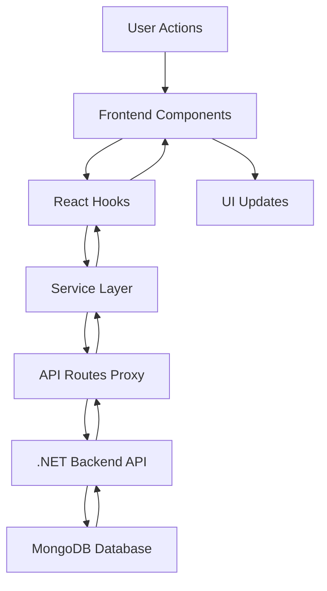

# 🏠 Million Property Viewer

[](https://nextjs.org/)
[](https://www.typescriptlang.org/)
[](https://tailwindcss.com/)
[](https://dotnet.microsoft.com/)

## 📖 Descripción

**Million Property Viewer** es una aplicación web full-stack moderna para la gestión completa de propiedades inmobiliarias. Integra un frontend desarrollado en Next.js 15 con TypeScript y un backend robusto en .NET 8, ofreciendo funcionalidades completas de CRUD, gestión de imágenes, transacciones y propietarios.

### ✨ Características Principales

- 🏡 **Gestión Completa de Propiedades**: CRUD completo con validaciones
- 👥 **Gestión de Propietarios**: Sistema de owners con información detallada
- 💰 **Gestión de Transacciones**: Histórico de property traces
- 🖼️ **Sistema de Imágenes**: Carga y gestión de imágenes por URL
- 🔍 **Búsqueda Avanzada**: Filtros en tiempo real por múltiples criterios
- 📱 **Diseño Responsivo**: Sistema de diseño unificado y consistent
- ⚡ **API REST**: Integración con backend .NET 8 y MongoDB
- 🎨 **UI/UX Moderna**: Sistema de estilos centralizado y profesional

## 🏗️ Arquitectura de la Aplicación

### 📋 Arquitectura General

```
┌─────────────────────────────────────────────────────────────┐
│                     FRONTEND (Next.js 15)                  │
├─────────────────────────────────────────────────────────────┤
│  App Router │ TypeScript │ Tailwind CSS │ React Hooks      │
├─────────────────────────────────────────────────────────────┤
│                    API Routes (Proxy)                      │
├─────────────────────────────────────────────────────────────┤
│                     HTTP Requests                          │
└─────────────────────────────────────────────────────────────┘
                               │
                               ▼
┌─────────────────────────────────────────────────────────────┐
│                    BACKEND (.NET 8 Web API)                │
├─────────────────────────────────────────────────────────────┤
│  Clean Architecture │ Controllers │ Services │ Repository  │
├─────────────────────────────────────────────────────────────┤
│                      MongoDB Driver                        │
├─────────────────────────────────────────────────────────────┤
│                     MongoDB Database                       │
└─────────────────────────────────────────────────────────────┘
```

### 🎯 ¿Por qué esta Arquitectura?

#### **Frontend: Next.js 15 + TypeScript**
- **App Router**: Nueva arquitectura de Next.js para mejor rendimiento
- **TypeScript**: Tipado estático para reducir errores y mejorar DX
- **Sistema de Estilos Centralizado**: Consistencia visual en toda la app
- **API Routes como Proxy**: Abstracción del backend para mejor seguridad

#### **Backend: .NET 8 + Clean Architecture**
- **Clean Architecture**: Separación de responsabilidades y testabilidad
- **MongoDB**: Base de datos NoSQL flexible para propiedades complejas
- **RESTful API**: Estándar de la industria para APIs
- **Inyección de Dependencias**: Mejor mantenibilidad y testing

## 🚀 Funcionalidades Principales

### 🏠 **Gestión de Propiedades**

#### ✅ **CRUD Completo**
- **Crear**: Modal con formulario validado
- **Leer**: Listado paginado con filtros
- **Actualizar**: Edición de propiedades existentes
- **Eliminar**: Eliminación con confirmación y limpieza de datos relacionados

#### 📊 **Campos de Propiedad**
```typescript
interface Property {
  id: number;
  name: string;
  address: string;
  price: number;
  codeInternal: string;
  year: number;
  idOwner: number;
}
```

### 👥 **Gestión de Propietarios**

#### � **Sistema de Owners**
- **Crear propietarios**: Información básica y foto
- **Asociar propiedades**: Relación one-to-many
- **Validación de datos**: Campos obligatorios y formatos

#### 📋 **Campos de Propietario**
```typescript
interface Owner {
  id: number;
  name: string;
  address: string;
  photo?: string;
}
```

### 🖼️ **Sistema de Imágenes**

#### 📸 **Gestión de Imágenes**
- **Carga por URL**: Sistema basado en URLs de imágenes
- **Múltiples imágenes por propiedad**: Galería de fotos
- **Preview en tiempo real**: Vista previa antes de guardar
- **Optimización automática**: Next.js Image optimization

#### 🗂️ **Estructura de Imágenes**
```typescript
interface PropertyImage {
  id: number;
  idProperty: number;
  url: string;
  enabled: boolean;
}
```

### 💰 **Sistema de Transacciones**

#### � **Property Traces**
- **Histórico de cambios**: Registro de modificaciones
- **Tipos de transacción**: Venta, compra, actualización de precio
- **Auditoría completa**: Who, when, what changed

#### 📝 **Estructura de Transacciones**
```typescript
interface PropertyTrace {
  id: number;
  dateSale: Date;
  name: string;
  value: number;
  tax: number;
  idProperty: number;
}
```

### 🔍 **Sistema de Búsqueda**

#### 🎯 **Filtros Avanzados**
- **Por nombre**: Búsqueda textual en tiempo real
- **Por ubicación**: Filtro por dirección/ciudad
- **Por rango de precios**: Min/Max con validación
- **Combinación de filtros**: Múltiples criterios simultáneos

#### ⚡ **Optimizaciones de Búsqueda**
- **Debounce**: Evita requests excesivos
- **Paginación**: Carga eficiente de resultados
- **Estado de loading**: Feedback visual al usuario

## 🛠️ Tecnologías y Herramientas

### 🎨 **Frontend Stack**
- **Next.js 15.4.6**: React framework con App Router
- **TypeScript**: Tipado estático
- **Tailwind CSS**: Utility-first CSS framework
- **React Hooks**: useState, useEffect, custom hooks
- **Sistema de Estilos Centralizado**: Consistencia visual

### ⚙️ **Backend Stack**
- **.NET 8**: Framework web moderno y performante
- **ASP.NET Core Web API**: RESTful API
- **MongoDB**: Base de datos NoSQL
- **Clean Architecture**: Separación en capas
- **Dependency Injection**: IoC container nativo

### 🔧 **Herramientas de Desarrollo**
- **ESLint**: Linting para JavaScript/TypeScript
- **Prettier**: Formateo de código
- **Git**: Control de versiones
- **VS Code**: Editor recomendado

## 📁 Estructura del Proyecto

### �️ **Frontend Structure**
```
app/
├── components/           # Componentes React reutilizables
│   ├── CreatePropertyModal.tsx    # Modal para crear propiedades
│   ├── PropertyCard.tsx           # Card de propiedad
│   ├── PropertyList.tsx           # Lista de propiedades
│   ├── Filters.tsx               # Componente de filtros
│   └── PropertyDetailModal.tsx   # Modal de detalles
├── hooks/               # Custom React Hooks
│   └── useProperties.ts # Hook para gestión de propiedades
├── lib/                 # Utilidades y configuración
│   ├── styles.ts        # Sistema de estilos centralizado
│   ├── types.ts         # Interfaces TypeScript
│   └── utils.ts         # Funciones de utilidad
├── services/            # Servicios para APIs
│   ├── api.ts           # Cliente HTTP principal
│   ├── images.ts        # Gestión de imágenes
│   └── propertyDetails.ts # Detalles de propiedades
├── api/                 # API Routes (Proxy al backend)
│   ├── properties/      # CRUD de propiedades
│   ├── owners/          # Gestión de propietarios
│   ├── property-images/ # Gestión de imágenes
│   └── property-traces/ # Gestión de transacciones
├── globals.css          # Estilos globales
└── page.tsx             # Página principal
```

### 🏛️ **Backend Architecture (.NET 8)**
```
Backend/
├── Controllers/         # API Controllers
│   ├── PropertiesController.cs
│   ├── OwnersController.cs
│   └── PropertyImagesController.cs
├── Services/            # Business Logic
│   ├── PropertyService.cs
│   └── OwnerService.cs
├── Repositories/        # Data Access Layer
│   ├── IPropertyRepository.cs
│   └── PropertyRepository.cs
├── Models/              # Domain Models
│   ├── Property.cs
│   ├── Owner.cs
│   └── PropertyImage.cs
└── Infrastructure/      # MongoDB Configuration
    └── MongoDbContext.cs
```

## 🎨 Sistema de Diseño

### 🎯 **Diseño Centralizado**
Implementamos un sistema de estilos centralizado en `lib/styles.ts` que garantiza:

- **Consistencia Visual**: Todos los componentes usan los mismos estilos
- **Mantenibilidad**: Un solo lugar para cambios globales
- **Escalabilidad**: Fácil agregar nuevos estilos estándar
- **Profesionalismo**: Aplicación cohesiva sin "parches" visuales

### 🎨 **Paleta de Colores**
```css
:root {
  --primary-blue: #2563eb;     /* Azul principal */
  --primary-indigo: #4f46e5;   /* Índigo secundario */
  --border-color: #d1d5db;     /* Bordes neutros */
  --text-primary: #111827;     /* Texto principal */
  --text-secondary: #6b7280;   /* Texto secundario */
}
```

### 🔧 **Componentes Estándar**
```typescript
// Estilos de inputs estandarizados
inputStyles: {
  base: "w-full px-4 py-3 border-2 border-gray-300 rounded-xl focus:ring-2 focus:ring-blue-500 focus:border-blue-500 bg-white text-gray-900 placeholder-gray-400 shadow-sm transition-all duration-200 hover:border-gray-400 font-medium"
}

// Estilos de botones estandarizados
buttonStyles: {
  primary: "px-6 py-3 bg-gradient-to-r from-blue-600 to-indigo-600 text-white rounded-xl hover:from-blue-700 hover:to-indigo-700 transition-all duration-200 font-bold shadow-lg hover:shadow-xl transform hover:-translate-y-0.5"
}
```

## 🔄 Flujo de Datos

### � **Arquitectura de Datos**



### 🔍 **Ejemplo: Búsqueda de Propiedades**

1. **Usuario ingresa filtro** → `Filters.tsx`
2. **useProperties hook** → Gestiona estado y API calls
3. **Service layer** → `api.ts` prepara request
4. **API Route proxy** → `/api/properties/route.ts`
5. **Backend .NET** → `PropertiesController.cs`
6. **MongoDB query** → Filtra datos
7. **Response chain** → Datos de vuelta al frontend
8. **UI update** → `PropertyList.tsx` muestra resultados

## 🚀 Instalación y Uso

### 📋 **Prerrequisitos**
- Node.js 18+ 
- .NET 8 SDK
- MongoDB (local o Atlas)
- Git

### ⚡ **Instalación Rápida**

```bash
# 1. Clonar repositorio
git clone https://github.com/usuario/million-property-viewer.git
cd million-property-viewer

# 2. Instalar dependencias del frontend
npm install

# 3. Configurar variables de entorno
cp .env.example .env.local
# Editar .env.local con tu configuración

# 4. Levantar el backend .NET (puerto 5064)
cd backend
dotnet run

# 5. Levantar el frontend (puerto 3000)
cd ../
npm run dev
```

### 🌐 **URLs de la Aplicación**
- **Frontend**: http://localhost:3000
- **Backend API**: http://localhost:5064
- **API Docs**: http://localhost:5064/swagger

## 🔧 Configuración de Entorno

### 📝 **Variables de Entorno (.env.local)**
```env
# Backend API URL
NEXT_PUBLIC_API_BASE_URL=http://localhost:5064

# MongoDB (para el backend .NET)
MONGODB_CONNECTION_STRING=mongodb://localhost:27017
MONGODB_DATABASE_NAME=MillionPropertyDB
```

### ⚙️ **Backend Configuration (appsettings.json)**
```json
{
  "ConnectionStrings": {
    "MongoDB": "mongodb://localhost:27017/MillionPropertyDB"
  },
  "Cors": {
    "AllowedOrigins": ["http://localhost:3000"]
  }
}
```

## 📚 API Endpoints

### 🏠 **Properties Endpoints**
```bash
GET    /api/properties              # Listar propiedades (con filtros)
POST   /api/properties              # Crear nueva propiedad
GET    /api/properties/{id}         # Obtener propiedad específica
PUT    /api/properties/{id}         # Actualizar propiedad
DELETE /api/properties/{id}         # Eliminar propiedad
```

### 👥 **Owners Endpoints**
```bash
GET    /api/owners                  # Listar propietarios
POST   /api/owners                  # Crear nuevo propietario
GET    /api/owners/{id}             # Obtener propietario específico
PUT    /api/owners/{id}             # Actualizar propietario
DELETE /api/owners/{id}             # Eliminar propietario
```

### 🖼️ **Property Images Endpoints**
```bash
GET    /api/property-images         # Listar imágenes
POST   /api/property-images         # Agregar nueva imagen
DELETE /api/property-images/{id}    # Eliminar imagen
```

### 💰 **Property Traces Endpoints**
```bash
GET    /api/property-traces         # Listar transacciones
POST   /api/property-traces         # Crear nueva transacción
GET    /api/property-traces/{propertyId} # Transacciones por propiedad
```

## 📋 Testing y Desarrollo

### 🧪 **Comandos de Desarrollo**
```bash
# Desarrollo del frontend
npm run dev          # Servidor de desarrollo
npm run build        # Build de producción
npm run start        # Servidor de producción
npm run lint         # Linting del código

# Testing del backend
dotnet test          # Ejecutar tests unitarios
dotnet run --watch   # Hot reload del backend
```

### 🔍 **Debug y Monitoreo**
- **Frontend**: React DevTools
- **Backend**: Swagger UI en `/swagger`
- **API**: Network tab en DevTools
- **Database**: MongoDB Compass

## 🎯 Características Técnicas Destacadas

### ⚡ **Optimizaciones de Rendimiento**
- **Image Optimization**: Next.js Image component
- **Lazy Loading**: Carga diferida de componentes
- **API Caching**: Estrategias de cache en API calls
- **Bundle Splitting**: Código dividido automáticamente

### � **Seguridad y Validación**
- **Input Validation**: Validación en frontend y backend
- **CORS Configuration**: Configuración segura de CORS
- **Type Safety**: TypeScript en todo el stack frontend
- **Error Handling**: Manejo robusto de errores

### 📱 **Responsividad y UX**
- **Mobile First**: Diseño optimizado para móviles
- **Loading States**: Feedback visual en todas las operaciones
- **Error Messages**: Mensajes de error claros y útiles
- **Smooth Animations**: Transiciones suaves y profesionales

## 🤝 Contribución

### 📝 **Guías de Contribución**
1. Fork el repositorio
2. Crear rama feature (`git checkout -b feature/nueva-funcionalidad`)
3. Commit cambios (`git commit -am 'Agregar nueva funcionalidad'`)
4. Push a la rama (`git push origin feature/nueva-funcionalidad`)
5. Crear Pull Request

### 🎯 **Estándares de Código**
- **ESLint**: Seguir configuración establecida
- **TypeScript**: Tipado estricto obligatorio
- **Conventional Commits**: Formato de commits estándar
- **Sistema de Estilos**: Usar componentes centralizados

## 📄 Licencia

Este proyecto está bajo la Licencia MIT. Ver el archivo `LICENSE` para más detalles.

## 👨‍💻 Autor

**Million Property Viewer** - Aplicación desarrollada como prueba técnica

- 🌐 **Frontend**: Next.js 15 + TypeScript + Tailwind CSS
- ⚙️ **Backend**: .NET 8 + MongoDB + Clean Architecture
- 🎨 **Diseño**: Sistema de estilos centralizado y responsivo

---

⭐ **¡Dale una estrella si te gustó este proyecto!** ⭐

### Styling & UI
- **Tailwind CSS 3.4** - Framework de CSS utility-first
- **Geist Font** - Tipografía moderna de Vercel
- **CSS Grid & Flexbox** - Layout responsivo

### Optimización & Performance
- **Next.js Image** - Optimización automática de imágenes
- **Turbopack** - Bundler ultra-rápido para desarrollo
- **ESLint** - Linter para calidad de código
- **PostCSS** - Procesamiento de CSS

### API & Data Management
- **API Routes** - Endpoints internos de Next.js
- **Custom Hooks** - useProperties para manejo de estado
- **TypeScript Interfaces** - Tipado de datos

## 📁 Estructura del Proyecto

```
million-property-viewer/
├── 📁 app/                          # App Router (Next.js 15)
│   ├── 📁 api/                      # API Routes
│   │   └── 📁 properties/           
│   │       └── route.ts             # Endpoint de propiedades
│   ├── 📁 components/               # Componentes React
│   │   ├── Filters.tsx              # Filtros de búsqueda
│   │   ├── PropertyCard.tsx         # Card de propiedad individual
│   │   └── PropertyList.tsx         # Lista de propiedades
│   ├── 📁 hooks/                    # Custom React Hooks
│   │   └── useProperties.ts         # Hook para manejo de propiedades
│   ├── 📁 lib/                      # Utilidades y tipos
│   │   ├── types.ts                 # Interfaces TypeScript
│   │   └── utils.ts                 # Funciones utilitarias
│   ├── 📁 services/                 # Servicios de API
│   │   └── api.ts                   # Cliente de API
│   ├── favicon.ico                  # Favicon del sitio
│   ├── globals.css                  # Estilos globales
│   ├── layout.tsx                   # Layout principal
│   └── page.tsx                     # Página principal
├── 📁 public/                       # Archivos estáticos (vacío - optimizado)
├── 📄 next.config.js                # Configuración de Next.js
├── 📄 package.json                  # Dependencias del proyecto
├── 📄 tailwind.config.ts            # Configuración de Tailwind
├── 📄 tsconfig.json                 # Configuración de TypeScript
└── 📄 README.md                     # Documentación del proyecto
```

## 🚀 Instalación y Configuración

### Prerrequisitos

- **Node.js** >= 18.17.0
- **npm** >= 9.0.0 o **yarn** >= 1.22.0

### 1. Clonar el Repositorio

```bash
git clone https://github.com/Danidiaz0799/million-property-viewer.git
cd million-property-viewer
```

### 2. Instalar Dependencias

```bash
# Con npm
npm install

# Con yarn
yarn install

# Con pnpm
pnpm install
```

### 3. Ejecutar en Desarrollo

```bash
# Con npm
npm run dev

# Con yarn
yarn dev

# Con pnpm
pnpm dev
```

### 4. Abrir en el Navegador

Abre [http://localhost:3000](http://localhost:3000) en tu navegador.

## 🎯 Scripts Disponibles

```bash
# Desarrollo
npm run dev          # Inicia servidor de desarrollo con Turbopack

# Producción
npm run build        # Construye la aplicación para producción
npm run start        # Inicia servidor de producción

# Calidad de Código
npm run lint         # Ejecuta ESLint para revisar código
```

## 🏗️ Arquitectura del Proyecto

### 🧩 Componentes Principales

#### **PropertyCard.tsx**
```typescript
// Componente individual para mostrar información de propiedad
interface Property {
  idOwner: string;
  name: string;
  address: string;
  price: number;
  imageUrl: string;
}
```

#### **Filters.tsx**
```typescript
// Sistema de filtros con búsqueda en tiempo real
interface PropertyFilters {
  name?: string;
  address?: string;
  minPrice?: number;
  maxPrice?: number;
}
```

#### **useProperties Hook**
```typescript
// Custom hook para manejo de estado de propiedades
const { properties, loading, error, handleSearch } = useProperties();
```

### 🛣️ API Routes

#### **GET /api/properties**
```typescript
// Endpoint para obtener propiedades con filtros opcionales
// Query parameters: name, address, minPrice, maxPrice
// Response: Property[]
```

### 🎨 Sistema de Diseño

#### Colores Principales
- **Primary**: `#0ea5e9` (Sky Blue)
- **Secondary**: `#64748b` (Slate Gray)
- **Success**: `#10b981` (Emerald)
- **Background**: `#f8fafc` (Slate 50)

#### Tipografía
- **Font Family**: Geist Sans / Geist Mono
- **Sizes**: text-sm, text-base, text-lg, text-xl, text-2xl, text-3xl

#### Responsive Breakpoints
- **Mobile**: `< 768px`
- **Tablet**: `768px - 1024px`
- **Desktop**: `> 1024px`

## 📊 Características Técnicas

### ⚡ Optimizaciones de Performance

1. **Image Optimization**
   - Next.js Image component con lazy loading
   - Priority loading para las primeras 3 imágenes
   - Formatos optimizados (WebP, AVIF)

2. **Code Splitting**
   - Componentes cargados bajo demanda
   - Tree shaking automático

3. **SEO Optimization**
   - Metadata estructurada
   - Viewport configuration
   - Semantic HTML

### 🔒 Calidad de Código

- **TypeScript**: Tipado estático completo
- **ESLint**: Reglas de linting configuradas
- **Prettier**: Formateo automático de código
- **Error Boundaries**: Manejo de errores en componentes

### 📱 Responsive Design

- **Mobile First**: Diseño optimizado para móviles
- **Flexbox & Grid**: Layouts modernos y flexibles
- **Touch Friendly**: Botones y elementos optimizados para touch

## 🚀 Deployment

### Vercel (Recomendado)

1. Conecta tu repositorio a [Vercel](https://vercel.com)
2. Configura las variables de entorno (si las hay)
3. Deploy automático en cada push

### Otros Proveedores

- **Netlify**: Soporte completo para Next.js
- **AWS Amplify**: Deploy con CI/CD
- **Railway**: Deploy rápido y sencillo

## 🤝 Contribución

### Proceso de Contribución

1. **Fork** el repositorio
2. **Crea** una branch para tu feature (`git checkout -b feature/AmazingFeature`)
3. **Commit** tus cambios (`git commit -m 'Add some AmazingFeature'`)
4. **Push** a la branch (`git push origin feature/AmazingFeature`)
5. **Abre** un Pull Request

### Guías de Contribución

- Sigue las convenciones de código existentes
- Añade tests para nuevas funcionalidades
- Actualiza la documentación cuando sea necesario
- Usa commits descriptivos

## 📝 Roadmap

### 🎯 Versión 2.0 (Próximamente)

- [ ] **Autenticación de usuarios**
- [ ] **Favoritos y wishlist**
- [ ] **Comparación de propiedades**
- [ ] **Mapa interactivo**
- [ ] **Filtros avanzados** (habitaciones, amenidades)
- [ ] **Integración con APIs reales**
- [ ] **Dashboard de administración**
- [ ] **Notificaciones push**

### 🔧 Mejoras Técnicas

- [ ] **PWA** (Progressive Web App)
- [ ] **Offline support**
- [ ] **Database integration** (PostgreSQL/MongoDB)
- [ ] **API rate limiting**
- [ ] **Unit & Integration tests**
- [ ] **Performance monitoring**

## 📄 Licencia

Este proyecto está bajo la licencia **MIT**. Ver el archivo [LICENSE](LICENSE) para más detalles.

## 👥 Autores

- **Steven Díaz** - *Desarrollo inicial* - [@Danidiaz0799](https://github.com/Danidiaz0799)

## 🙏 Agradecimientos

- **Next.js Team** - Por el increíble framework
- **Vercel** - Por las herramientas de desarrollo
- **Tailwind CSS** - Por el sistema de diseño
- **Unsplash** - Por las imágenes de alta calidad

---

<div align="center">

**🏠 Million Property Viewer** - *Encuentra tu hogar ideal*

[🌐 Demo](https://million-property-viewer.vercel.app) | [📖 Docs](https://github.com/Danidiaz0799/million-property-viewer) | [🐛 Issues](https://github.com/Danidiaz0799/million-property-viewer/issues)

</div>
